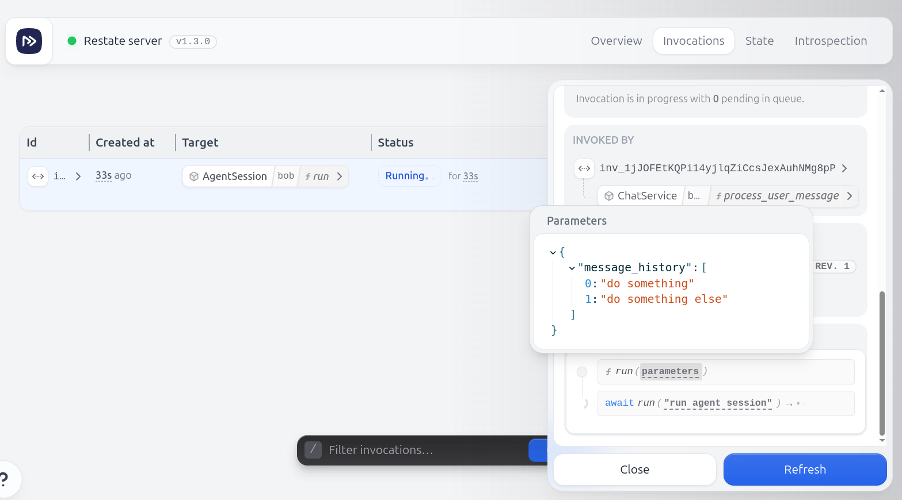
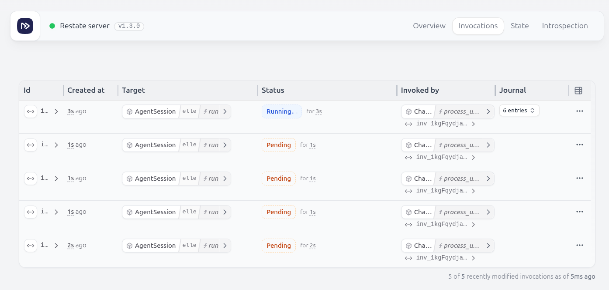

# Restate AI Agents examples

A small example of an interruptible agent, that gets invoked via a chat session.

Important files:
- [`chat.py`](app/chat.py): The chat VO, which receives the user input and agent responses. It tracks ongoing agent sessions and cancels them on new user input.
- [`agent_session.py`](app/agent_session.py): The agent session VO, which executes the agent loop.

The agent has three modes:
- **INTERRUPT**: The current agent will be canceled when a new user input is received. A new run will be started. You could implement a rollback mechanism to restore the previous state.
- **INCORPORATE**: On its next iteration, the agent will check if a new user input has been received. If so, it will incorporate the new input into its current state and continue running.
- **QUEUE**: The current agent will continue running. The new user input will be queued as a new agent run request and will be processed after the current agent run is finished.

## Running the example

Start the service:
```shell
MODE=INCORPORATE uv run app/main.py
```
or use `MODE=INTERRUPT` or `MODE=QUEUE`.

Start Restate:
```shell
restate-server
```

Open the UI on http://localhost:9070 and register your deployment running at `http://localhost:9080`.

Then, start a task:
```shell
curl localhost:8080/ChatService/ellie/process_user_message \
  --json '{
  "content": "do something",
  "role": "user"
}'
```

A bit later, start a new task:

```shell
curl localhost:8080/ChatService/ellie/process_user_message \
  --json '{
  "content": "do something else",
  "role": "user"
}'
```

Depending on the mode you selected, the behavior will be different.

### `INTERRUPT` mode

In this mode, the current agent will be canceled when a new user input is received. A new run will be started. You could implement a rollback mechanism to restore the previous state ([see saga guide](https://docs.restate.dev/guides/sagas)).

If you send a few messages to the same session, you will see the cancellation in the logs and the UI will show only the new task.

```text
NFO:chat:Starting new agent run
INFO:agent_session:Running iteration of agent for ellie with input items: message_history=['do something']
INFO:agent_session:Agent generated output for ellie: Do another iteration
INFO:agent_session:Running iteration of agent for ellie with input items: message_history=['do something', 'system: Do another iteration']
INFO:chat:Interrupting ongoing agent run
INFO:chat:Starting new agent run
INFO:agent_session:Running iteration of agent for ellie with input items: message_history=['do something', 'do something else']
INFO:agent_session:Agent generated output for ellie: Do another iteration
INFO:agent_session:Running iteration of agent for ellie with input items: message_history=['do something', 'do something else', 'system: Do another iteration']
```




### `INCORPORATE` mode

In this mode, the agent will check if a new user input has been received on its next iteration. If so, it will incorporate the new input into its current state and continue running.

If you send a few messages to the same session, you will see the logs printing the new user input:

```text
INFO:chat:Starting new agent run
INFO:agent_session:Running iteration of agent for sara with input items: message_history=['do something']
INFO:agent_session:Agent generated output for sara: Do another iteration
INFO:agent_session:Running iteration of agent for sara with input items: message_history=['do something', 'system: Do another iteration']
INFO:chat:Incorporating new input into ongoing agent run
INFO:agent_session:Resolved awakeable with ID sign_1V1LeRYjtPiwBlu1DdbuuLAqXisP_7vHtAAAAEQ with new input for sara: do something else
INFO:agent_session:Agent generated output for sara: Do another iteration
INFO:agent_session:Incorporating new input for sara: do something else
INFO:agent_session:Running iteration of agent for sara with input items: message_history=['do something', 'system: Do another iteration', 'system: Do another iteration', 'do something else']
INFO:agent_session:Agent generated output for sara: Do another iteration
INFO:agent_session:Running iteration of agent for sara with input items: message_history=['do something', 'system: Do another iteration', 'system: Do another iteration', 'do something else', 'system: Do another iteration']
```

Depending on how you want to handle the new input, you can also choose to cancel the current iteration (by pulling it into a Service handler) and start a new one with the new input. 

### `QUEUE` mode

In this mode, the new tasks get queued. If you send a few messages to the same session, you will see the pending tasks in the UI.

